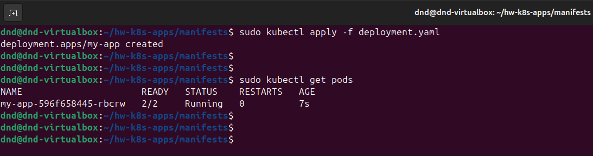
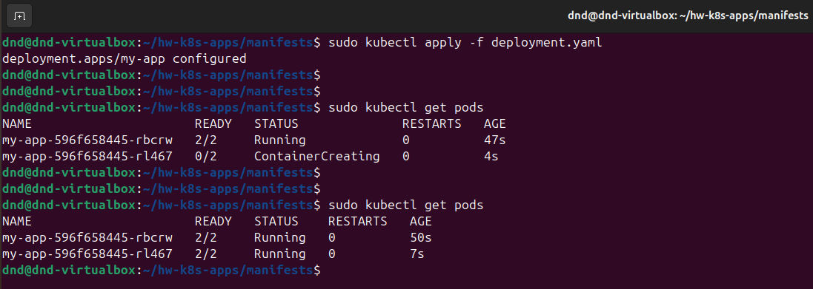
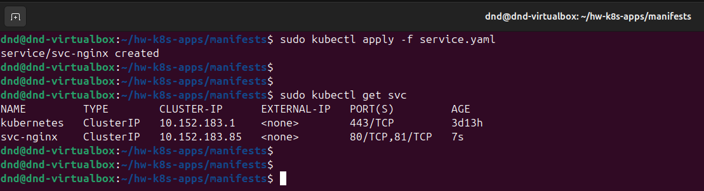
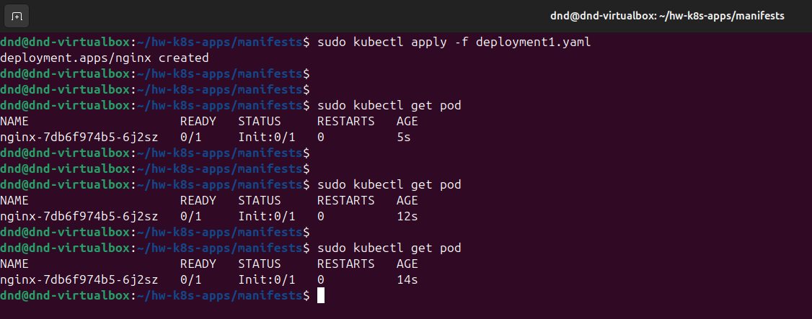

# Домашнее задание к занятию "`Запуск приложений в K8S`" - `Дедюрин Денис`

---
## Задание 1. Создать Deployment и обеспечить доступ к репликам приложения из другого Pod

1. Создать Deployment приложения, состоящего из двух контейнеров — nginx и multitool. Решить возникшую ошибку.
2. После запуска увеличить количество реплик работающего приложения до 2.
3. Продемонстрировать количество подов до и после масштабирования.
4. Создать Service, который обеспечит доступ до реплик приложений из п.1.
5. Создать отдельный Pod с приложением multitool и убедиться с помощью `curl`, что из пода есть доступ до приложений из п.1.

### Ответ:

1. Создаем манифест **deployment.yaml** и применяем его:

```
apiVersion: apps/v1
kind: Deployment
metadata:
  name: my-app
spec:
  replicas: 1
  selector:
    matchLabels:
      app: my-app
  template:
    metadata:
      labels:
        app: my-app
    spec:
      containers:
      - name: nginx
        image: nginx:1.21
        ports:
        - containerPort: 80
      - name: multitool
        image: wbitt/network-multitool
        env:
          - name: HTTP_PORT
            value: "81"
        ports:
        - containerPort: 81
        name: http-port
```

```
sudo kubectl apply -f deployment.yaml
```

Проверяем, создались ли поды:

```
sudo kubectl get pods
```



2. Увеличиваем количество реплик до **2** (меняем **replicas: 1** → **replicas: 2**) и повторно применяем манифест:

```
sudo kubectl apply -f deployment.yaml
```

Проверяем, создались ли поды:

```
sudo kubectl get pods
```



3. Создаем сервис **service.yaml**, который обеспечит доступ до реплик приложений и применяем его:

```
apiVersion: v1
kind: Service
metadata:
  name: svc-nginx
spec:
  ports:
    - name: nginx
      protocol: TCP
      port: 80
    - name: multitool
      protocol: TCP
      port: 81
  selector:
    app: my-app
```

```
sudo kubectl apply -f service.yaml
```

Проверяем, создался ли сервис:

```
sudo kubectl get svc
```




4. Создаем отдельный Pod **mt-pod.yaml** с приложением multitool, запускаем и проверяем:

```
apiVersion: v1
kind: Pod
metadata:
  name: multitool-test
spec:
  containers:
  - name: multitool
    image: wbitt/network-multitool
    command: ["sleep", "3600"]
```

```
sudo kubectl apply -f mt-pod.yaml
```

Проверяем, создался ли под:

```
sudo kubectl get pods
```


Проверяем, что из пода есть доступ до приложений:

```
sudo kubectl exec -it mt-pod -- /bin/bash
```

```
curl svc-nginx:80
```

```
curl svc-nginx:81
```


---
## Задание 2. Создать Deployment и обеспечить старт основного контейнера при выполнении условий

1. Создать Deployment приложения nginx и обеспечить старт контейнера только после того, как будет запущен сервис этого приложения.
2. Убедиться, что nginx не стартует. В качестве Init-контейнера взять busybox.
3. Создать и запустить Service. Убедиться, что Init запустился.
4. Продемонстрировать состояние пода до и после запуска сервиса.

### Ответ:

1. Создаем Deployment приложения nginx:

```
apiVersion: apps/v1
kind: Deployment
metadata:
  name: nginx
  labels:
    app: nginx
spec:
  replicas: 1
  selector:
    matchLabels:
      app: nginx
  template:
    metadata:
      labels:
        app: nginx
    spec:
      containers:
        - name: nginx
          image: nginx:1.21
          ports:
          - containerPort: 80
      initContainers:
        - name: init-myservice
          image: busybox
          command: [ 'sh', '-c', "until nslookup svc-nginx.$(cat /var/run/secrets/kubernetes.io/serviceaccount/namespace).svc.cluster.local; do echo waiting for myservice; sleep 2; done"]
```

Пробуем запустить и проверить запустится ли Pod:

```
sudo kubectl apply -f deployment1.yaml
```

```
sudo kubectl get pods
```

2. Видим, что nginx не стартует:



3. Создаем манифест сервиса **service1.yaml** и применяем его:

```
apiVersion: v1
kind: Service
metadata:
  name: svc-nginx
spec:
  selector:
    app: nginx
  ports:
    - port: 80
      targetPort: 80
```

```
sudo kubectl apply -f service1.yaml
```

```
sudo kubectl get svc
```


4. Проверяем, что под запустился:

```
sudo kubectl get pods
```


